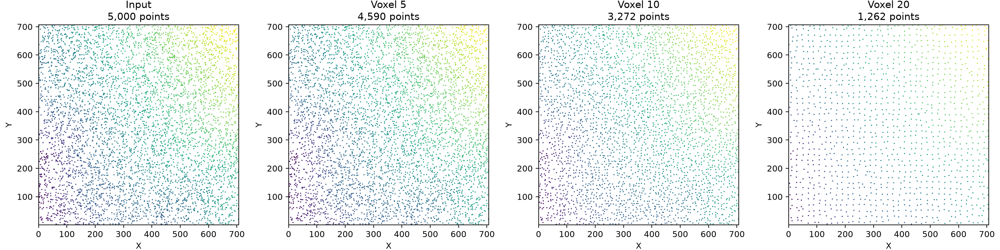

# Point Cloud Playground

Reproducible point-cloud experiments that connect method selection,
implementation, quantitative evaluation, and documented interpretation.

Version 0.2.0 evaluates statistical outlier filtering under controlled noise.
It extends the voxel-downsampling study from v0.1.0 and applies both
experiments to a deterministic synthetic surface and a traceable public USGS
3DEP lidar sample.

## Research Questions

### Outlier filtering

How does the distance threshold of a statistical outlier filter affect
detection quality and preservation of valid geometry?

The working hypothesis is that a lower threshold will detect more injected
outliers but remove more valid points, while a higher threshold will preserve
more valid points at the cost of missed outliers. The best operating point is
expected to depend on the point-cloud geometry and density.

### Voxel downsampling

How does voxel size change point count, point spacing, and geometric coverage
when a point cloud is reduced?

The working hypothesis is that larger voxels reduce local density and storage
requirements at the cost of increasing the distance between the original
points and their nearest retained representation.

## Features

- Deterministic injection of labeled vertical outliers
- Mean k-nearest-neighbor statistical filtering using SciPy
- Precision, recall, F1, inlier-retention, and coverage measurements
- Deterministic controlled-density point-cloud generation
- Centroid-based voxel downsampling implemented with NumPy
- Whitespace-delimited XYZ loading and writing
- CSV metrics, filtered XYZ files, and static comparison plots
- A versioned public-data sample with source checksum and preparation metadata
- CLI workflows and focused unit tests

## Quick Start

Use Python 3.10 or later in an isolated environment.

```bash
git clone https://github.com/cab0a/pointcloud-playground.git
cd pointcloud-playground
python -m pip install -e .

pointcloud-playground generate-demo demo.xyz
pointcloud-playground evaluate-outliers demo.xyz \
  --output-dir output/outliers
```

The outlier evaluation writes:

```text
output/outliers/
├── comparison.png
├── contaminated.xyz
├── filtered_std_0p5.xyz
├── filtered_std_1.xyz
├── filtered_std_1p5.xyz
├── filtered_std_2.xyz
├── filtered_std_2p5.xyz
├── filtered_std_3.xyz
├── labels.csv
└── metrics.csv
```

## Usage

Generate a repeatable synthetic surface with uneven point density:

```bash
pointcloud-playground generate-demo demo.xyz --points 6000 --seed 42
```

Inject 5% labeled outliers and evaluate a sweep of statistical thresholds:

```bash
pointcloud-playground evaluate-outliers demo.xyz \
  --outlier-fraction 0.05 \
  --distance-scale 0.25 \
  --neighbors 16 \
  --std-ratios 0.5 1.0 1.5 2.0 2.5 3.0 \
  --seed 42 \
  --output-dir output/outliers
```

Run the voxel-downsampling experiment:

```bash
pointcloud-playground evaluate demo.xyz \
  --voxel-sizes 0.25 0.5 1.0 \
  --output-dir output/downsampling
```

Evaluate the included USGS-derived sample at scale-appropriate voxel sizes:

```bash
pointcloud-playground evaluate data/usgs_3dep_iowa/sample.xyz \
  --voxel-sizes 5 10 20 \
  --output-dir output/usgs
```

Reproduce all committed metrics and figures:

```bash
python experiments/run_reference_experiments.py
```

Rebuild the public sample from the checksum-pinned source LAZ file:

```bash
python -m pip install -e ".[data]"
python experiments/prepare_public_sample.py
```

## Methodology

### Controlled outlier injection

The clean point cloud is treated as reference geometry. Synthetic outliers are
sampled uniformly within its XY footprint and placed above or below its Z
range. Their offset is a fixed multiple of a geometry-derived scale:

```text
vertical scale = max(Z range, 0.05 × XY diagonal)
outlier offset = vertical scale × distance scale × U(1, 2)
```

The requested outlier fraction describes the final contaminated cloud, subject
to integer rounding. A fixed random seed makes point generation and ordering
repeatable. Ground-truth labels are retained for evaluation.

### Statistical outlier filtering

For every point, the mean Euclidean distance to its 16 nearest neighbors is
computed. A point is classified as an outlier when its score exceeds:

```text
global mean score + standard-deviation ratio × global score standard deviation
```

The reference experiment holds the neighborhood size constant and sweeps the
standard-deviation ratio from 0.5 to 3.0. The highest-F1 result is selected for
the comparison figure; all threshold results remain in `metrics.csv`.

### Voxel downsampling

The coordinate minimum defines the voxel-grid origin. Each point is assigned
to a voxel using the floor of its offset divided by the voxel size. Every
occupied voxel is represented by the centroid of its points.

### Metrics

| Metric | Definition | Interpretation |
| --- | --- | --- |
| Precision | Correct removals / all removals | Reliability of an outlier decision |
| Recall | Correct removals / all true outliers | Fraction of injected outliers detected |
| F1 | Harmonic mean of precision and recall | Balanced detection score |
| Inlier retention | Retained valid points / all valid points | Preservation of clean geometry |
| Clean coverage RMSE | RMSE from each clean point to the nearest filtered point | Geometric impact of false removals |
| Retention ratio | Output points / input points | Fraction remaining after downsampling |
| Mean nearest-neighbor distance | Mean distance to each point's nearest other point | Typical point spacing |
| Coverage RMSE | RMSE from each input point to the nearest output point | Geometric coverage lost during reduction |

All coordinates and distances use the units of the input XYZ file.

## Evaluation

### Controlled outliers: synthetic surface

The clean input contains 6,000 points over a 20-by-20 unit wavy surface, with
one third of the samples concentrated near its center. The experiment adds 316
outliers, giving a final outlier fraction of 5%.

| Std. ratio | Precision | Recall | F1 | Inliers retained | Coverage RMSE |
| ---: | ---: | ---: | ---: | ---: | ---: |
| 0.5 | 0.263 | 1.000 | 0.417 | 85.3% | 0.187 |
| 1.0 | 0.697 | 0.984 | 0.816 | 97.8% | 0.068 |
| **1.5** | **0.923** | **0.946** | **0.934** | **99.6%** | **0.030** |
| 2.0 | 0.986 | 0.867 | 0.923 | 99.9% | 0.013 |
| 2.5 | 0.996 | 0.744 | 0.851 | 100.0% | 0.010 |
| 3.0 | 1.000 | 0.579 | 0.733 | 100.0% | 0.000 |


The low threshold detects every injected outlier but also removes 884 valid
points. Increasing the ratio reduces false removals, while recall begins to
fall. A ratio of 1.5 gives the highest F1 in this controlled case; this is an
experimental result, not a general default.

### Controlled outliers: public USGS 3DEP sample

The public-data input contains 5,000 ground-classified points selected
deterministically from a USGS 3DEP Iowa lidar tile. The experiment adds 263
outliers with the same fraction, relative distance scale, neighborhood size,
threshold sweep, and seed as the synthetic experiment.

| Std. ratio | Precision | Recall | F1 | Inliers retained | Coverage RMSE |
| ---: | ---: | ---: | ---: | ---: | ---: |
| 0.5 | 0.321 | 1.000 | 0.486 | 88.9% | 4.332 |
| 1.0 | 0.639 | 0.996 | 0.779 | 97.0% | 2.243 |
| 1.5 | 0.822 | 0.947 | 0.880 | 98.9% | 1.310 |
| **2.0** | **0.916** | **0.913** | **0.914** | **99.6%** | **0.926** |
| 2.5 | 0.963 | 0.791 | 0.868 | 99.8% | 0.620 |
| 3.0 | 0.976 | 0.624 | 0.761 | 99.9% | 0.365 |


The same precision-recall trade-off appears, but the highest-F1 ratio changes
from 1.5 to 2.0. This difference supports the original hypothesis: even under
controlled contamination, threshold selection depends on the source geometry
and sampling pattern. A production decision should also reflect whether
missed noise or removed surface detail is more costly.

### Voxel downsampling: synthetic surface

| Voxel size | Output points | Retained | Output mean NN distance | Coverage RMSE |
| ---: | ---: | ---: | ---: | ---: |
| 0.25 | 3,545 | 59.1% | 0.203 | 0.065 |
| 0.50 | 1,628 | 27.1% | 0.352 | 0.168 |
| 1.00 | 434 | 7.2% | 0.813 | 0.382 |


Increasing voxel size regularizes the dense center and sharply reduces the
point count, while point spacing and coverage error both increase.

### Voxel downsampling: public USGS 3DEP sample

Source URL, checksums, counts, filter, seed, and coordinate offsets are
recorded in
[`manifest.csv`](data/usgs_3dep_iowa/manifest.csv).

| Voxel size | Output points | Retained | Output mean NN distance | Coverage RMSE |
| ---: | ---: | ---: | ---: | ---: |
| 5 | 4,590 | 91.8% | 5.832 | 0.643 |
| 10 | 3,272 | 65.4% | 7.790 | 2.429 |
| 20 | 1,262 | 25.2% | 15.399 | 6.896 |



The 5-unit setting changes this sparse subset only modestly. At 10 and 20
units, point reduction becomes substantial and coverage error rises.

## Project Structure

```text
pointcloud-playground/
├── data/                         # Versioned synthetic and public samples
├── experiments/                  # Sample preparation and reference runs
├── results/
│   ├── outlier_filtering/        # v0.2 metrics and figures
│   ├── synthetic/                # v0.1 synthetic results
│   └── usgs_3dep_iowa/           # v0.1 public-data results
├── src/pointcloud_playground/
│   ├── cli.py
│   ├── downsampling.py
│   ├── evaluation.py
│   ├── filtering_evaluation.py
│   ├── io.py
│   ├── outliers.py
│   ├── synthetic.py
│   └── visualization.py
├── tests/
├── LICENSE
├── README.md
└── pyproject.toml
```

## Limitations

- Injected noise is limited to isolated points above or below the reference
  cloud. It does not model clustered noise, multipath returns, or near-surface
  sensor artifacts.
- The source cloud is assumed to be clean. Ground-truth labels apply only to
  injected points and do not validate the original USGS classifications.
- The filter uses one global distance threshold and is sensitive to varying
  density, neighborhood size, geometry, and coordinate scale.
- F1 assigns equal importance to precision and recall. An application may
  require a different cost function and validation dataset.
- Selecting the highest-F1 threshold uses the injected ground-truth labels and
  is an evaluation procedure, not an unsupervised production-tuning method.
- XYZ input stores coordinates only; intensity, classification, color, and
  coordinate reference systems are not preserved.
- The implementation loads the complete cloud into memory and is not intended
  for large-scale production processing.
- The public sample is a small, ground-only subset rather than a complete lidar
  scene, so its results must not be generalized to all 3D data.
- Comparison figures are diagnostic projections, not full 3D viewers.

## Roadmap

- **v0.3:** Normal-estimation reliability and neighborhood selection
- **v0.4:** Rigid registration with measurable perturbations
- **v0.5:** Cross-experiment summaries and interface review

Each extension will keep the same pattern: define a question, control the
input, implement the method, evaluate the result, and document limitations.

## License

The source code is available under the [MIT License](LICENSE).

The included USGS 3DEP-derived sample is public domain. Its source and
preparation details are documented in
[`data/usgs_3dep_iowa/README.md`](data/usgs_3dep_iowa/README.md).
