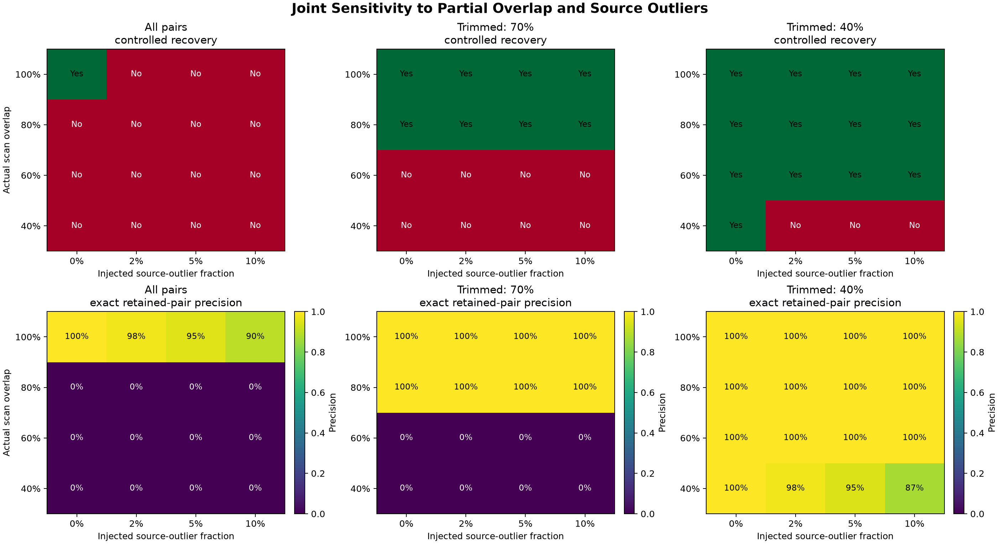

# Point Cloud Playground

## 日本語概要

点群のdownsampling、outlier filtering、normal estimation、rigid
registrationを、既知の形状・変換・対応点・ラベルで定量評価する実験基盤です。
点群アルゴリズムの挙動、精度、失敗条件を確認したいR&Dエンジニアやレビュー担当者に
役立ちます。

7つのCLI実験、決定論的なsynthetic data、USGS 3DEP由来サンプル、CSV metrics、
比較図、再生成検証、Python 3.10〜3.14のCIを含みます。評価条件、結果、主張できる
範囲、制約の詳細は英語本文とリンク先の技術資料を参照してください。

---

[](https://github.com/cab0a/pointcloud-playground/actions/workflows/ci.yml)

Evaluate point-cloud algorithms with known geometry, controlled failure
conditions, and reviewable CSV and image artifacts.

## Overview

Point Cloud Playground is a controlled evaluation suite for R&D engineers and
reviewers who need to distinguish a plausible-looking point cloud from a
measurably correct result. It tests geometric methods under changes in density,
noise, initial transform, scan overlap, and source contamination.

The deterministic synthetic surface provides analytic normals, exact generating
pairs, known transforms, overlap membership, and injected-outlier labels. A
checksum-pinned USGS 3DEP-derived sample provides a separate public-data check.
The public sample broadens the review context but does not turn controlled
results into a deployment claim.

| At a glance | Evidence |
| --- | --- |
| Methods | Voxel downsampling, statistical outlier filtering, PCA normals, and point-to-point ICP |
| Evaluation scope | Seven experiments across a synthetic surface and a public lidar sample |
| Minimum run | `pointcloud-playground generate-demo demo.xyz` followed by an `evaluate-*` command |
| Primary outputs | `metrics.csv` and `comparison.png` for every evaluation |
| Review support | Known ground truth where available, committed reference results, and automated regeneration checks |

## Representative Result

The joint-sensitivity experiment evaluates 48 conditions per dataset: four
overlap levels, four controlled source-outlier rates, and three
correspondence-retention policies. It exposes the boundary where a fixed
retained fraction can exceed the proportion of source points that can have
valid target matches.



The numeric evidence in
[`metrics.csv`](results/joint_sensitivity/synthetic/metrics.csv) includes
correspondence composition, exact-pair precision and recall, outlier rejection,
residuals, transform error, and recovery status.

## Key Features

- Seven CLI-driven experiments with a consistent artifact contract
- Deterministic fixtures with geometry-derived scales and explicit random seeds
- Controlled labels and known transforms for measuring recovery rather than
  relying on visual plausibility
- A traceable, ground-only USGS 3DEP-derived sample with source and sample
  checksums
- Method-specific metrics and explicit selection rules without a combined
  cross-method ranking
- Non-destructive reference regeneration, artifact verification, pytest, wheel
  checks, and CI on Python 3.10 through 3.14

## Quick Start

Use Python 3.10 or later in an isolated environment. On Debian or Ubuntu,
install `python3-venv` if `venv` reports that `ensurepip` is unavailable.

```bash
git clone https://github.com/cab0a/pointcloud-playground.git
cd pointcloud-playground
python3 -m venv .venv
source .venv/bin/activate
python -m pip install -e .
pointcloud-playground generate-demo demo.xyz
pointcloud-playground evaluate-joint-sensitivity demo.xyz \
  --output-dir output/joint_sensitivity
```

Review `output/joint_sensitivity/comparison.png` for the visual comparison and
`output/joint_sensitivity/metrics.csv` for all evaluated conditions. The first
command creates the deterministic input `demo.xyz`.

See the [CLI and output reference](docs/cli-reference.md) for all experiment
commands, options, default output directories, and the Python API entry point.

## Generated Artifacts

Every evaluation writes the same two primary files below its selected output
directory:

| Artifact | Purpose |
| --- | --- |
| `metrics.csv` | Machine-readable measurements for every evaluated condition |
| `comparison.png` | Static diagnostic views, curves, or heatmaps for review |
| Method-specific XYZ or CSV files | Aligned clouds, filtered clouds, labels, normals, or point-level diagnostics |
| Summary outputs | `experiment_summary.csv`, `README.md`, and `comparison.png` across committed experiments |

Reference outputs use
`results/<experiment>/<dataset>/`. The complete inventory is documented in
[`results/README.md`](results/README.md).

## Experiment Matrix

| Experiment | Question | Distinctive evidence |
| --- | --- | --- |
| Voxel downsampling | How does voxel size trade point count for geometric coverage? | Retention, point spacing, and coverage error |
| Outlier filtering | How does the threshold trade detection recall for preservation of valid geometry? | Injected labels, precision, recall, F1, and inlier retention |
| Normal estimation | How does neighborhood size affect accuracy, repeatability, and spatial support? | Analytic normals on synthetic data; stability-only evidence on public data |
| Rigid registration | How does initialization affect ICP recovery within a fixed budget? | Known transform, known-pair error, nearest-neighbor error, and convergence |
| Partial-overlap registration | Can fixed-fraction trimming reduce bias from unmatched scan regions? | Known overlap and all-pairs versus 70%-trimmed ICP |
| Trim sensitivity | What happens when the retained fraction exceeds actual overlap? | Exact-pair precision and recall across a fixed overlap/fraction grid |
| Joint sensitivity | How do partial overlap and source outliers interact? | Valid-pair fraction, correspondence composition, rejection, and recovery |

The experiment questions, controlled constructions, metric definitions, and
complete interpretations are preserved in
[Experiment Design and Evaluation Results](docs/evaluation-results.md).

## Evaluation Methodology

The suite separates measurements according to the available ground truth:

- The synthetic surface supports analytic-normal accuracy, known-transform
  recovery, exact generating-pair diagnostics, overlap labels, and injected
  outlier labels.
- The public sample supports the same controlled transforms, overlap
  construction, and injected labels, but it has no independent reference
  normals. Its normal result therefore measures perturbation repeatability, not
  accuracy.
- Distances are normalized by median point spacing when comparing inputs with
  different coordinate scales.
- Representative conditions follow explicit rules. F1, angular error,
  geometric coverage, and transform recovery are not combined into one score.

The full protocol and metric definitions are in
[the evaluation reference](docs/evaluation-results.md#evaluation-methodology).

## Results

The generated summary contains fourteen records: seven experiments across two
datasets. This table keeps each method's primary evidence on its own scale.

| Experiment | Synthetic surface | Public USGS 3DEP sample |
| --- | --- | --- |
| Voxel downsampling | Voxel 0.25: 59.1% retained | Voxel 10: 65.4% retained |
| Outlier filtering | Ratio 1.5: F1 0.934 | Ratio 2.0: F1 0.914 |
| Normal estimation | k=64: mean reference error 0.846° | k=64: median repeatability error 0.091° |
| Rigid registration | 3/4 recovered; largest angle 10° | 2/4 recovered; largest angle 5° |
| Partial overlap | Trimmed 2/4 recovered; all-pairs 1/4 | Trimmed 2/4 recovered; all-pairs 1/4 |
| Trim sensitivity | Fraction 0.4: 4/4 recovered; mean precision 100% | Fraction 0.4: 4/4 recovered; mean precision 100% |
| Joint sensitivity | Fraction 0.4: 13/16 recovered; mean precision 98.7% | Fraction 0.4: 13/16 recovered; mean precision 98.9% |


The results show claim boundaries as well as successes. The highest-F1 outlier
threshold changes between datasets. The public normal result is stability
evidence only. Registration requires more iterations and recovers fewer tested
offsets on the public sample. Fixed trimming improves several controlled
partial-overlap cases, but its observed boundary is not a universal parameter
recommendation.

Selection rules and evidence scope are recorded in
[`results/summary/README.md`](results/summary/README.md). Per-condition tables,
figures, failure explanations, and rounding edge cases are in the
[complete results](docs/evaluation-results.md#results).

## Reproducibility

Regenerate all committed experiments into a separate directory without
changing `results/`:

```bash
python experiments/run_reference_experiments.py \
  --output-root reproduced_results
```

Regenerate the suite in a temporary directory and compare it with the committed
evidence:

```bash
python experiments/verify_reference_results.py
```

The verifier checks both versioned inputs, every CSV report, the generated
Markdown summary, and the inventory, validity, and dimensions of every figure.
Numeric CSV values use explicit tolerances; PNG files are not compared
byte-for-byte because rendering can vary across environments. Exact commands,
tolerances, provenance, and determinism boundaries are documented in
[`docs/reproducibility.md`](docs/reproducibility.md).

## Documentation

| Document | Contents |
| --- | --- |
| [CLI and output reference](docs/cli-reference.md) | All evaluation commands, output directories, filenames, and API entry point |
| [Experiment design and results](docs/evaluation-results.md) | Hypotheses, protocols, metrics, complete result tables, and interpretations |
| [Limitations and claim boundaries](docs/limitations.md) | Detailed scope limits for every experiment and the verifier |
| [Python API](docs/api.md) | Public names, array and XYZ contracts, examples, errors, units, and stability policy |
| [Reproducibility](docs/reproducibility.md) | Inputs, regeneration, comparison tolerances, and determinism boundaries |
| [Release checklist](docs/release-checklist.md) | Compatibility, build, CI, release, and sensitive-information review |
| [Changelog](CHANGELOG.md) | Versioned public history |

## Limitations

- Controlled synthetic labels and transforms measure the stated protocols; they
  do not establish performance on unrelated sensor scans.
- The public input is a small, ground-only lidar subset, not a complete scene,
  and it has no reference normals.
- Partial overlap uses X-ordered slabs from one indexed cloud. It does not model
  viewpoint visibility, occlusion, independent sampling, or sensor trajectories.
- The ICP implementation omits multiscale initialization, robust loss,
  point-to-plane objectives, reciprocal matching, and distance thresholds.
- XYZ I/O does not preserve color, intensity, classification, or coordinate
  reference systems, and the implementation loads the complete cloud into
  memory.
- The verifier establishes implementation repeatability for committed inputs;
  it is not independent scientific replication or evidence of external
  validity.

See [Limitations and Claim Boundaries](docs/limitations.md) for the complete
list, including method-specific evaluation and interpretation constraints.

## Project Layout

| Path | Role |
| --- | --- |
| `src/pointcloud_playground/` | Processing, evaluation, reporting, and visualization code |
| `experiments/` | Public-sample preparation, reference generation, and verification |
| `tests/` | Unit, CLI, API, evaluation, and reproducibility checks |
| `data/` | Versioned synthetic and public reference inputs |
| `results/` | Committed CSV, Markdown, XYZ, and image evidence |
| `docs/` | API, CLI, evaluation, limitations, reproducibility, and release references |

## Development and Testing

Install the development extras and run the complete suite:

```bash
python -m pip install -e ".[dev]"
python -m pytest
python -m build
```

Tests cover XYZ I/O, deterministic generation, downsampling, normal estimation,
outlier injection and filtering, registration, overlap and trim evaluation,
summaries, public API behavior, CLI output, and reproducibility. GitHub Actions
runs the suite, builds distributions, installs the wheel, and checks the
installed CLI on Python 3.10 through 3.14.

## Compatibility

Version 1.0.0 defines the stable 1.x contract. The documented top-level Python
API, existing CLI commands and aliases, primary output filenames, and existing
CSV columns remain compatible throughout the 1.x series. The exact data, error,
extension, and deprecation boundaries are in [`docs/api.md`](docs/api.md).

## License

The source code is available under the [MIT License](LICENSE).

The included USGS 3DEP-derived sample is public domain. Its source and
preparation details are documented in
[`data/usgs_3dep_iowa/README.md`](data/usgs_3dep_iowa/README.md).
