# Experiment Design and Evaluation Results

## 日本語概要

本書は、点群の間引き、外れ値除去、法線推定、剛体位置合わせ、部分重なり、対応点の選別率、重なり率と外れ値率の同時感度を扱う7種類の統制実験を記録します。合成点群と公開点群について、条件、指標、結果、解釈可能な範囲を対応付けています。

実験設計、数値表、評価指標、結果の詳細は以下の英語本文を参照してください。

---

This document preserves the complete experiment questions, controlled
protocols, metric definitions, results, and interpretation behind the concise
project overview in the [README](../README.md). The sections report evidence
for the committed inputs and stated conditions; they do not define universal
parameter recommendations.

## Technical Design

### Joint overlap and outlier sensitivity

How do partial scan overlap and controlled source contamination interact, and
when does a fixed retained-correspondence fraction exceed the proportion of
source points that can have valid target matches?

The working hypothesis is that trimming will reject isolated source outliers
when enough true overlap remains. At the boundary where the trim fraction
equals clean overlap, adding even a small number of source-only outliers is
expected to make the retained fraction larger than the available valid-pair
fraction and bias the transform estimate.

### Trim-fraction sensitivity

How does the retained-correspondence fraction interact with actual scan
overlap, and what happens to correspondence precision and recall when the
retained fraction exceeds the available overlap?

The working hypothesis is that smaller fractions will reject unmatched scan
regions and improve precision, but will retain fewer correct overlap pairs.
Fractions above the true overlap are expected to admit unavoidable non-overlap
pairs, bias the transform estimate, and create a sharp recovery boundary.

### Partial-overlap registration

How does decreasing scan overlap affect point-to-point ICP, and can fixed-
fraction correspondence trimming reduce the bias introduced by non-overlapping
regions?

The working hypothesis is that all-pairs ICP will become biased as overlap
falls, while retaining only the closest correspondences will improve recovery
at moderate overlap. A fixed trim fraction is also expected to reach a limit
as the true overlap becomes smaller than the retained fraction.

### Cross-experiment review

Can results from different point-cloud methods be made easier to inspect
without collapsing incompatible metrics into a single score or implied
ranking?

The working hypothesis is that a common summary schema, explicit condition
selection rules, and a consistent result layout can improve reviewability
while preserving the evidence scope and limitations of each experiment.

### Rigid registration

How does the magnitude of a known initial rotation and translation affect
point-to-point ICP recovery within a fixed iteration budget?

The working hypothesis is that small misalignments will recover the known
source-to-target transform, while larger misalignments will require more
iterations and eventually exceed the fixed budget. Nearest-neighbor RMSE is
also expected to understate alignment error when ICP settles on incorrect
correspondences.

### Normal estimation

How does neighborhood size affect the accuracy, perturbation stability, and
spatial support of PCA-estimated point-cloud normals?

The working hypothesis is that larger neighborhoods will reduce sensitivity
to coordinate noise, while also increasing the spatial scale over which local
geometry is approximated. The most stable setting is therefore not
automatically the most appropriate setting for preserving local detail.

### Outlier filtering

How does the distance threshold of a statistical outlier filter affect
detection quality and preservation of valid geometry?

The working hypothesis is that a lower threshold will detect more injected
outliers but remove more valid points, while a higher threshold will preserve
more valid points at the cost of missed outliers. The best operating point is
expected to depend on the point-cloud geometry and density.

### Voxel downsampling

How does voxel size change point count, point spacing, and geometric coverage
when a point cloud is reduced?

The working hypothesis is that larger voxels reduce local density and storage
requirements at the cost of increasing the distance between the original
points and their nearest retained representation.

## Experiment and Interface Coverage

- Stable 1.x compatibility contract for public Python and CLI interfaces
- Wheel build and installation verification across Python 3.10 through 3.14
- Public changelog and repeatable stable-release checklist
- Reviewed top-level Python API for core I/O, processing, and registration
- Documented array, XYZ, CLI, output, error, and compatibility contracts
- Non-destructive reference generation into a caller-selected output root
- Automated input-integrity and regenerated-artifact verification
- Joint 4-by-4 sweep of scan overlap and source-outlier contamination
- All-pairs ICP compared with fixed 70% and 40% retained fractions
- Stable source labels for overlap, clean non-overlap, and injected outliers
- Effective valid-pair fraction and outlier-rejection diagnostics
- Recovery and exact retained-pair precision heatmaps for each policy
- Fixed 0.4-to-1.0 trim-fraction grid across four controlled overlap levels
- Retained-source overlap ratio and overlap-source retention diagnostics
- Exact nearest-neighbor match precision and recall from known overlap pairs
- Retained and rejected residual diagnostics normalized by median spacing
- Recovery and known-overlap error heatmaps with precision and recall curves
- Controlled equal-size scan pairs with 100%, 80%, 60%, and 40% overlap
- All-pairs ICP compared with ICP retaining the closest 70% of correspondences
- Known-overlap, all-source nearest-neighbor, and transform-recovery metrics
- Scale-normalized error curves and aligned XYZ outputs for each overlap case
- Cross-experiment CSV, Markdown, and visual evidence summaries
- Explicit representative-condition rules without universal recommendations
- Canonical `results/<experiment>/<dataset>/` reference layout
- Consistent evaluation commands, default output directories, and filenames
- Backward-compatible `evaluate` alias for `evaluate-downsampling`
- Point-to-point ICP implemented with SciPy nearest-neighbor search and NumPy
  rigid least-squares alignment
- Controlled axis-angle rotations and spacing-relative translations
- Rotation, translation, known-correspondence, and nearest-neighbor errors
- Fixed-budget convergence diagnostics across increasing initial offsets
- Batched local PCA normal estimation across configurable neighborhood sizes
- Analytic normal ground truth for the controlled synthetic surface
- Sign-invariant angular accuracy and perturbation-repeatability metrics
- Neighborhood-radius and surface-variation diagnostics
- Deterministic injection of labeled vertical outliers
- Mean k-nearest-neighbor statistical filtering using SciPy
- Precision, recall, F1, inlier-retention, and coverage measurements
- Deterministic controlled-density point-cloud generation
- Centroid-based voxel downsampling implemented with NumPy
- Whitespace-delimited XYZ loading and writing
- CSV metrics, filtered XYZ files, and static comparison plots
- A versioned public-data sample with source checksum and preparation metadata
- CLI workflows and focused unit tests


## Evaluation Methodology

### Cross-experiment summary

The summary reads the fourteen committed `metrics.csv` files from seven
experiments and two datasets. Each row uses the same schema: experiment,
dataset, number of evaluated conditions, selected condition, selection rule,
primary evidence, secondary evidence, evidence scope, and source path.

One representative condition is selected per experiment and dataset:

| Experiment | Selection rule |
| --- | --- |
| Voxel downsampling | Retention ratio closest to 50%, as a review point rather than an optimum |
| Outlier filtering | Highest F1 against controlled injected labels |
| Normal estimation, synthetic | Lowest mean error against analytic reference normals |
| Normal estimation, public | Lowest median perturbation error, reported as stability rather than accuracy |
| Rigid registration | Fraction converged with known-pair RMSE no greater than 0.01 times median spacing |
| Partial-overlap registration | Recovery rates for fixed 70% trimming and all-pairs ICP across the same overlap sweep |
| Trim sensitivity | Highest recovery rate across the overlap sweep; ties retain more correspondences |
| Joint sensitivity | Highest recovery rate across the overlap-contamination grid; ties retain more correspondences |

The summary deliberately does not create a combined score. F1, angular error,
coverage, and transform recovery describe different questions and cannot be
ranked on a shared quality axis.

### Joint sensitivity to overlap and source outliers

The v0.8 experiment combines the partial-overlap construction with isolated
vertical source outliers. It uses the same 2-degree rotation, half-spacing
translation, 80-iteration budget, and recovery criterion as the v0.6 and v0.7
registration experiments. The Cartesian product is:

```text
overlap ratios:           1.0, 0.8, 0.6, 0.4
source-outlier fractions: 0.0, 0.02, 0.05, 0.10
policies:                 all pairs, trim 0.7, trim 0.4
```

The requested outlier fraction describes the final source scan, subject to
integer rounding. Outliers are sampled within the source XY footprint and
placed above or below its Z range. For each overlap level, one deterministic
pool is generated and smaller contamination conditions use prefixes of that
pool. Outliers are appended rather than shuffled, preserving the generating
indices of all clean source points.

The controlled labels divide source points into true overlap, clean
non-overlap, and injected outliers. The experiment therefore reports both scan
overlap and the stricter fraction of the contaminated source that can have a
valid target pair:

```text
effective valid-pair fraction = known overlap points / contaminated source points
fraction-to-valid ratio = retained correspondence fraction / effective valid-pair fraction
outlier rejection rate = rejected injected outliers / injected outliers
```

Exact-match precision still requires the retained nearest target to be the
generating target index; simply retaining a source point from the overlap is
not counted as a correct match. All three policies use identical data for each
joint condition. The sweep is a controlled sensitivity study, not automatic
contamination estimation or parameter selection.

### Trim-fraction sensitivity and correspondence diagnostics

The v0.7 experiment reuses the controlled scan construction, 2-degree
rotation, half-spacing translation, 80-iteration budget, and recovery criterion
from v0.6. It evaluates the Cartesian product of:

```text
overlap ratios:  1.0, 0.8, 0.6, 0.4
trim fractions:  0.4, 0.5, 0.6, 0.7, 0.8, 0.9, 1.0
```

The `1.0` endpoint is ordinary all-pairs ICP. The other settings retain the
stated fraction of source-to-nearest-target pairs with the smallest residuals
at every iteration. No fraction is tuned independently for either dataset.

The construction also identifies which source points belong to the true
overlap and their exact generating target indices. After the final ICP
iteration, correspondences are sorted once more by residual for diagnostics:

```text
retained-source overlap ratio = retained sources in overlap / retained pairs
overlap-source retention = retained sources in overlap / known overlap points
correct-match precision = exact overlap matches / retained pairs
correct-match recall = exact overlap matches / known overlap points
```

Membership in the overlap is necessary but not sufficient for a correct match;
therefore the membership and exact-match measurements are reported separately.
The fraction with the highest recovery rate across the full overlap sweep is
shown in the cross-experiment summary, with ties favoring the fraction that
retains more correspondences. This is a labeled evaluation rule, not an
automatic parameter recommendation.

### Controlled partial-overlap registration

The input cloud is ordered by X to create two equal-size, partially overlapping
scans. The target takes points from the low-X end and the source reference takes
points from the high-X end. For a requested overlap ratio `r`, the approximate
number of points in each scan is:

```text
scan points = total points / (2 - r)
actual overlap = shared points / scan points
```

Integer rounding is reported through `actual_overlap_ratio`. The source scan
is then rotated by 2 degrees and translated by half the full cloud's median
point spacing. This deliberately modest initialization allows the experiment
to focus on overlap rather than the capture-range boundary measured in v0.4.

Two correspondence policies are evaluated under the same 80-iteration budget:

- **All-pairs ICP:** use the nearest target point for every source point.
- **Trimmed ICP:** retain the closest 70% of source-to-target pairs in each
  iteration before estimating the rigid transform.

The 70% fraction is a fixed study condition, not a tuned optimum. Because the
shared points retain their indices in both scans, the inverse transform and
the correct correspondences within the overlap are known. A case is counted as
recovered only when it converges and its known-overlap RMSE is no greater than
1% of median spacing.

### Controlled rigid registration

The input cloud is the registration target. A source cloud is created by
rotating the target around its centroid about the fixed axis `(0.3, -0.2, 1)`
and translating it in the fixed direction `(0.7, -0.4, 0.2)`. Direction
vectors are normalized before use. Translation magnitudes are defined relative
to each input's median nearest-neighbor spacing:

| Case | Initial rotation | Translation magnitude |
| --- | ---: | ---: |
| `case_01` | 2° | 0.5 × median spacing |
| `case_02` | 5° | 1 × median spacing |
| `case_03` | 10° | 2 × median spacing |
| `case_04` | 20° | 4 × median spacing |

Point-to-point ICP starts from the identity transform. Each iteration finds
one nearest target point for every current source point, estimates the rigid
least-squares transform with SVD, applies it, and composes it with the running
estimate. The maximum is 60 iterations, and convergence is declared when the
nearest-neighbor RMSE changes by no more than `1e-6 × median spacing`.

Because every source point was generated from a target point, the inverse
rotation and translation are known. This permits direct transform error and
known-correspondence RMSE measurements in addition to the objective used by
ICP. Numerical convergence means only that the stopping condition was met; it
does not prove correct registration.

### PCA normal estimation

For each point, the `k` nearest other points define a local neighborhood. The
neighborhood is centered, its 3-by-3 covariance matrix is computed, and the
eigenvector associated with the smallest eigenvalue is used as the local
normal. Normal signs are oriented toward positive Z for consistent terrain
visualization.

The synthetic surface has analytic reference normals derived from its
noise-free height function. Accuracy is measured by the sign-invariant angle
between the estimate and reference:

```text
angular error = arccos(|estimated normal · reference normal|)
```

For both datasets, deterministic isotropic Gaussian noise is added with a
standard deviation of 5% of the input's median nearest-neighbor spacing.
Normals are re-estimated after perturbation, and their angular change measures
repeatability. The same perturbed cloud is used for every neighborhood size.

Surface variation is reported as:

```text
smallest covariance eigenvalue / sum of covariance eigenvalues
```

It describes local non-planarity under the selected support and is not a
standalone accuracy score.

### Controlled outlier injection

The clean point cloud is treated as reference geometry. Synthetic outliers are
sampled uniformly within its XY footprint and placed above or below its Z
range. Their offset is a fixed multiple of a geometry-derived scale:

```text
vertical scale = max(Z range, 0.05 × XY diagonal)
outlier offset = vertical scale × distance scale × U(1, 2)
```

The requested outlier fraction describes the final contaminated cloud, subject
to integer rounding. A fixed random seed makes point generation and ordering
repeatable. Ground-truth labels are retained for evaluation.

### Statistical outlier filtering

For every point, the mean Euclidean distance to its 16 nearest neighbors is
computed. A point is classified as an outlier when its score exceeds:

```text
global mean score + standard-deviation ratio × global score standard deviation
```

The reference experiment holds the neighborhood size constant and sweeps the
standard-deviation ratio from 0.5 to 3.0. The highest-F1 result is selected for
the comparison figure; all threshold results remain in `metrics.csv`.

### Voxel downsampling

The coordinate minimum defines the voxel-grid origin. Each point is assigned
to a voxel using the floor of its offset divided by the voxel size. Every
occupied voxel is represented by the centroid of its points.

### Metrics

| Metric | Definition | Interpretation |
| --- | --- | --- |
| Rotation error | Angle of the residual rotation between estimated and known transforms | Orientation recovery |
| Translation error | Euclidean distance between estimated and known translation vectors | Position recovery in input units |
| Known-pair RMSE | RMSE between aligned source points and their generating target points | Ground-truth alignment error |
| Nearest-neighbor RMSE | RMSE from aligned source points to their nearest target points | ICP objective, which can accept incorrect pairs |
| Retained-pair objective RMSE | Nearest-neighbor RMSE over the correspondences retained by the selected policy | Optimization objective for all-pairs or trimmed ICP |
| Known-overlap RMSE | RMSE over shared source-target pairs only | Ground-truth alignment error under partial overlap |
| All-source nearest-neighbor RMSE | RMSE from every aligned source point to its nearest target point | Includes source-only regions with no correct target counterpart |
| Recovery rate | Recovered cases / evaluated cases | Controlled success frequency under the stated sweep and criterion |
| Retained-source overlap ratio | Retained pairs whose source belongs to the known overlap / retained pairs | Composition of the retained set before checking target identity |
| Retained-source non-overlap ratio | Retained clean source-only points / retained pairs | Clean unmatched contribution to the retained set |
| Retained-outlier ratio | Retained injected source outliers / retained pairs | Contaminated contribution to the retained set |
| Overlap-source retention | Retained overlap sources / all known overlap sources | Fraction of potentially valid source points kept |
| Correct-match precision | Retained exact overlap matches / retained pairs | Reliability of retained nearest-neighbor pairs |
| Correct-match recall | Retained exact overlap matches / all known overlap pairs | Fraction of ground-truth pairs retained correctly |
| Median retained residual | Median nearest-neighbor distance among retained pairs | Residual scale used by the trimmed objective |
| Median rejected residual | Median nearest-neighbor distance among rejected pairs | Separation between retained and excluded pairs; undefined at fraction 1.0 |
| Effective valid-pair fraction | Known overlap points / contaminated source points | Upper bound on source points with generating target pairs in the controlled joint experiment |
| Fraction-to-valid ratio | Retained correspondence fraction / effective valid-pair fraction | Whether the policy must retain more pairs than can be valid under the labels |
| Outlier rejection rate | Rejected injected outliers / all injected outliers | Exclusion of labeled contamination; undefined without injected outliers |
| Normalized error | Error divided by median point spacing | Scale-relative comparison between datasets |
| Reference angular error | Sign-invariant angle to an analytic reference normal | Accuracy on the controlled synthetic surface |
| Repeatability error | Angle between normals before and after controlled perturbation | Sensitivity to small coordinate changes |
| Neighborhood radius | Distance to the kth nearest point | Spatial support of the local estimate |
| Surface variation | Smallest covariance eigenvalue / eigenvalue sum | Local non-planarity at the selected support |
| Precision | Correct removals / all removals | Reliability of an outlier decision |
| Recall | Correct removals / all true outliers | Fraction of injected outliers detected |
| F1 | Harmonic mean of precision and recall | Balanced detection score |
| Inlier retention | Retained valid points / all valid points | Preservation of clean geometry |
| Clean coverage RMSE | RMSE from each clean point to the nearest filtered point | Geometric impact of false removals |
| Retention ratio | Output points / input points | Fraction remaining after downsampling |
| Mean nearest-neighbor distance | Mean distance to each point's nearest other point | Typical point spacing |
| Coverage RMSE | RMSE from each input point to the nearest output point | Geometric coverage lost during reduction |

All coordinates and distances use the units of the input XYZ file.

## Results

### v1.0 stable-release review

The stable-release review freezes the documented top-level Python API, existing
CLI commands and options, primary evaluation filenames, and existing CSV
columns for the 1.x series. Package metadata now identifies the project as
stable, links back to its repository and changelog, and includes a wheel build
and installation check in every supported Python-version CI job.

No experiment method, parameter, metric, committed result, or scientific
interpretation changed for v1.0. The same complete verifier used in v0.9 is run
as release evidence. The public checklist records compatibility, provenance,
sensitive-information, build, CI, tag, Release, and profile checks.

### v0.9 interface and reproducibility review

The review covers the import surface, installed-version reporting, command
names, default output directories, reference-result inventory, input
integrity, and regeneration behavior. Unit tests enforce the reviewed public
exports and keep runtime and package metadata versions synchronized.

The complete verifier regenerates fourteen dataset-level result sets, the
cross-experiment summary, and all diagnostic figures in a temporary directory.
CSV values are compared with explicit floating-point tolerances; Markdown is
compared exactly; PNG files are validated structurally because rendering bytes
can vary across supported environments. This verifies implementation
repeatability under the documented protocol, not independent scientific
replication on new datasets.

### Cross-experiment evidence snapshot

The v0.8 review contains fourteen summary records. The table shows the selected
review condition and its primary evidence; each row retains its own selection
rule and evidence scope in
[`results/summary/README.md`](../results/summary/README.md).

| Experiment | Synthetic surface | Public USGS 3DEP sample |
| --- | --- | --- |
| Voxel downsampling | Voxel 0.25: 59.1% retained | Voxel 10: 65.4% retained |
| Outlier filtering | Ratio 1.5: F1 0.934 | Ratio 2.0: F1 0.914 |
| Normal estimation | k=64: mean reference error 0.846° | k=64: median repeatability error 0.091° |
| Rigid registration | 3/4 recovered; largest angle 10° | 2/4 recovered; largest angle 5° |
| Partial overlap | Trimmed 2/4 recovered; all-pairs 1/4 | Trimmed 2/4 recovered; all-pairs 1/4 |
| Trim sensitivity | Fraction 0.4: 4/4 recovered; mean precision 100% | Fraction 0.4: 4/4 recovered; mean precision 100% |
| Joint sensitivity | Fraction 0.4: 13/16 recovered; mean precision 98.7% | Fraction 0.4: 13/16 recovered; mean precision 98.9% |

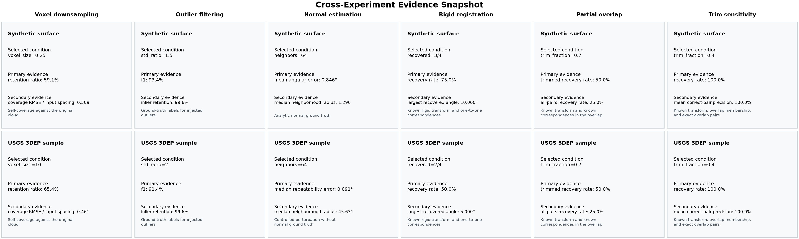

The summary makes three important boundaries visible. The outlier threshold
selected by F1 changes between datasets. The public normal result describes
repeatability rather than accuracy because no reference normals exist. The
registration recovery rate is lower for the public sample under the same
spacing-relative offsets and iteration budget. The partial-overlap comparison
shows the same recovery boundary on both reference datasets, but that does not
establish a universal trim fraction. The sensitivity sweep makes that boundary
visible and labels the selected 0.4 condition as an evaluation result rather
than a production default. The joint experiment then shows why that boundary
shifts after source outliers reduce the effective valid-pair fraction. These
observations remain method-specific evidence, not an overall dataset or
algorithm ranking.

### Joint sensitivity: synthetic surface

The 48-condition synthetic sweep shows a consistent interaction between
partial overlap and source contamination. All-pairs ICP recovers only the
uncontaminated full-overlap case. The 70% policy recovers every 100% and 80%
overlap condition, while the 40% policy also recovers every 60% condition.

| Policy | Recovered | 100% overlap | 80% overlap | 60% overlap | 40% overlap |
| --- | ---: | :---: | :---: | :---: | :---: |
| All pairs | 1/16 | Y--- | ---- | ---- | ---- |
| Trim 70% | 8/16 | YYYY | YYYY | ---- | ---- |
| Trim 40% | 13/16 | YYYY | YYYY | YYYY | Y--- |

Within each overlap cell, the symbols follow 0%, 2%, 5%, and 10% requested
outlier fractions from left to right.

At 40% overlap, the effective valid-pair fraction falls from 40.0% without
outliers to 39.2%, 38.0%, and 36.0% as contamination increases. A fixed 40%
policy must then retain some points without valid target pairs. Exact-pair
precision falls from 100% to 98.0%, 94.9%, and 87.0%; normalized known-overlap
RMSE rises from below 0.001 to 0.016, 0.061, and 0.210. All injected outliers
are rejected in these four conditions, so the remaining bias comes from the
need to retain additional clean non-overlap pairs, not from direct inclusion
of the isolated outliers.

### Joint sensitivity: public USGS 3DEP sample

The public sample produces the same recovery matrix across all 48 conditions.
Its scale and sampling pattern differ from the synthetic surface, but the
controlled labels expose the same valid-pair boundary.

| 40%-trim condition at 40% overlap | 0% outliers | 2% outliers | 5% outliers | 10% outliers |
| --- | ---: | ---: | ---: | ---: |
| Effective valid-pair fraction | 40.0% | 39.2% | 38.0% | 36.0% |
| Exact-pair precision | 100.0% | 98.0% | 95.0% | 89.9% |
| Outlier rejection | N/A | 100.0% | 100.0% | 98.3% |
| Known-overlap RMSE / spacing | <0.001 | 0.021 | 0.080 | 0.228 |
| Recovered | Yes | No | No | No |

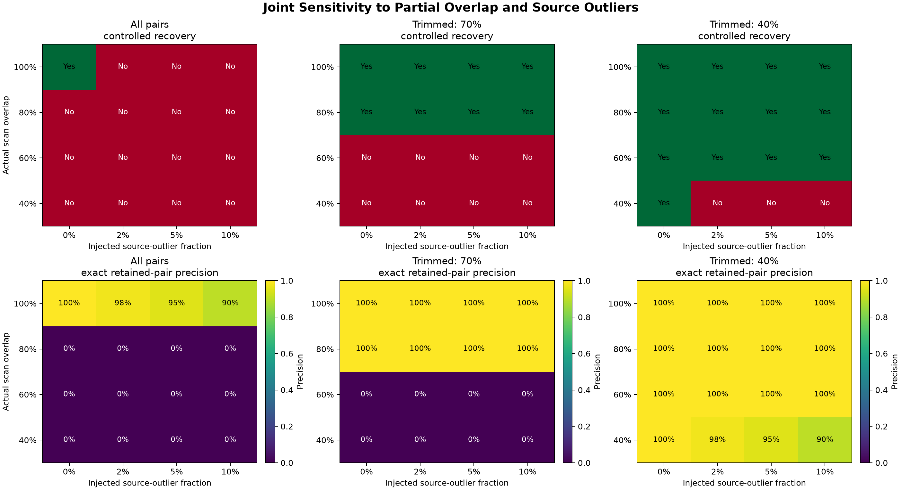

The result does not show that 40% trimming is generally preferable. It shows
that under this controlled initialization, it retains enough valid pairs for
more of the tested grid than 70% or all-pairs, while failing as soon as the
available valid-pair fraction drops below its fixed retained fraction at the
lowest overlap. Near-surface, clustered, or target-side contamination may
produce a different boundary.

### Trim sensitivity: synthetic surface

The recovery matrix follows the expected boundary. Full overlap recovers for
every fraction. Under partial overlap, the largest recovered fraction is equal
to the controlled overlap ratio; the next larger tested fraction fails.

| Trim fraction | 100% overlap | 80% overlap | 60% overlap | 40% overlap |
| ---: | :---: | :---: | :---: | :---: |
| 0.4 | Yes | Yes | Yes | Yes |
| 0.5 | Yes | Yes | Yes | No |
| 0.6 | Yes | Yes | Yes | No |
| 0.7 | Yes | Yes | No | No |
| 0.8 | Yes | Yes | No | No |
| 0.9 | Yes | No | No | No |
| 1.0 | Yes | No | No | No |

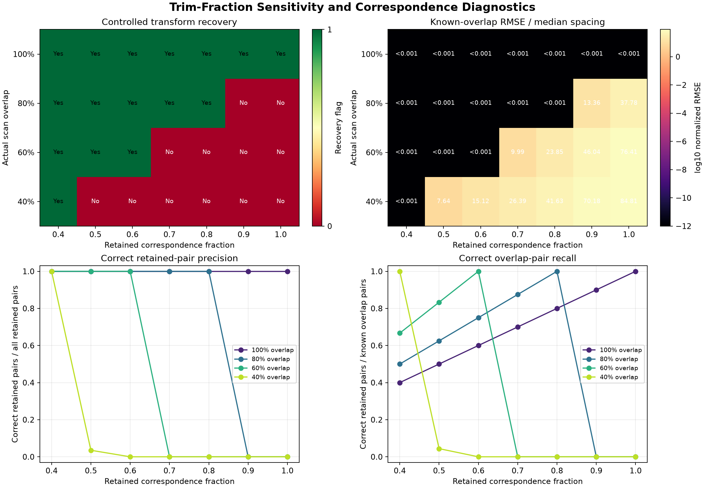

At the largest recovered fraction for 80%, 60%, and 40% overlap, exact-match
precision and recall are both 100%. Moving one grid step above the overlap
causes precision to fall to 0% for the 80% and 60% cases. In the 40% case,
fraction 0.5 retains only 3.52% correct pairs and produces known-overlap RMSE
of 7.639 times median spacing. The result links recovery failure to incorrect
retained correspondences rather than to the numerical stopping flag alone.

### Trim sensitivity: public USGS 3DEP sample

The public sample produces the same recovery matrix despite its different
scale, geometry, and sampling pattern.

| Actual overlap | Largest recovered fraction | Next tested fraction | Next-fraction precision | Next-fraction overlap RMSE / spacing |
| ---: | ---: | ---: | ---: | ---: |
| 80.01% | 0.8 | 0.9 | 0.0% | 9.925 |
| 59.98% | 0.6 | 0.7 | 0.0% | 9.408 |
| 40.00% | 0.4 | 0.5 | 0.0% | 8.369 |

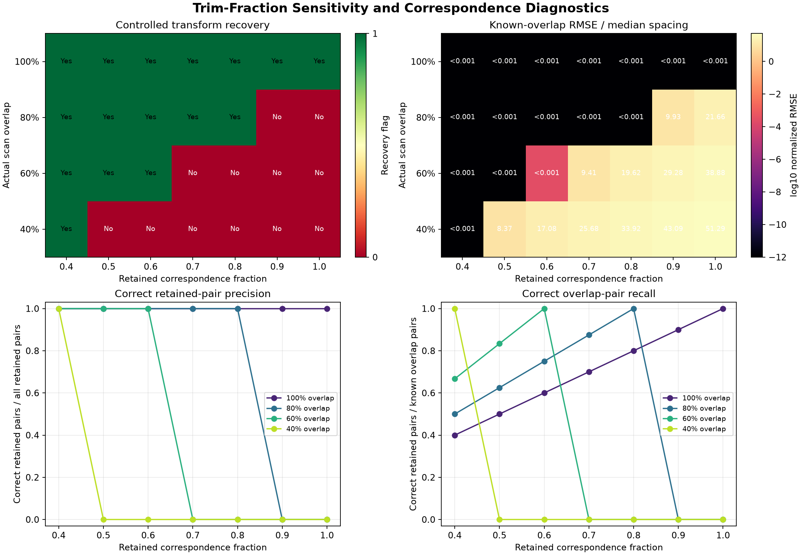

The 60% fraction retains one more pair than the rounded overlap count, giving
99.953% precision and 100% recall; its normalized known-overlap RMSE remains
0.000262 and satisfies the stated recovery criterion. This rounding edge case
is useful evidence that the observed boundary is approximate and protocol-
specific, not a theorem that the fraction must be numerically less than or
equal to overlap.

### Partial overlap: synthetic surface

Both methods recover the known transform at full overlap. At 80% overlap,
all-pairs ICP is pulled away from the correct transform by source-only points,
while the fixed 70% trimmed policy still recovers. At 60% and 40%, neither
method meets the recovery criterion within 80 iterations.

| Actual overlap | All-pairs recovered | All-pairs overlap RMSE / spacing | Trimmed recovered | Trimmed overlap RMSE / spacing | Trimmed all-source NN RMSE / spacing |
| ---: | :---: | ---: | :---: | ---: | ---: |
| 100% | Yes | <0.001 | Yes | <0.001 | <0.001 |
| 80% | No | 37.780 | Yes | <0.001 | 12.539 |
| 60% | No | 76.407 | No | 9.993 | 20.513 |
| 40% | No | 84.806 | No | 26.394 | 19.491 |

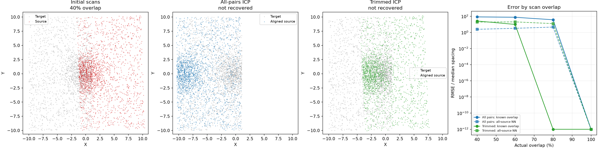

The exact 80% recovery has a high all-source nearest-neighbor RMSE because the
source-only region has no valid counterpart in the target. This is expected,
not contradictory: the known-overlap RMSE measures transform recovery, while
the all-source metric also measures unavoidable non-overlap distance.

### Partial overlap: public USGS 3DEP sample

The public sample shows the same qualitative boundary under the controlled
protocol: both methods recover at 100%, only trimmed ICP recovers at 80%, and
neither recovers at 60% or 40%.

| Actual overlap | All-pairs recovered | All-pairs overlap RMSE / spacing | Trimmed recovered | Trimmed overlap RMSE / spacing | Trimmed all-source NN RMSE / spacing |
| ---: | :---: | ---: | :---: | ---: | ---: |
| 100% | Yes | <0.001 | Yes | <0.001 | <0.001 |
| 80% | No | 21.659 | Yes | <0.001 | 6.281 |
| 60% | No | 38.882 | No | 9.408 | 10.357 |
| 40% | No | 51.290 | No | 25.680 | 9.075 |

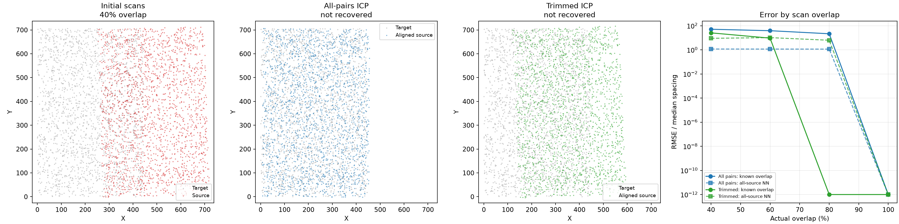

Trimming reduces known-overlap error at every incomplete-overlap condition,
but improvement is not equivalent to correct recovery. The fixed 70% policy
cannot reject enough unmatched pairs once true overlap falls to 60% or below,
and residual ordering can still retain incorrect pairs. The comparison
therefore supports trimming as a controlled mitigation, not as a generally
robust registration solution.

### Rigid registration: synthetic surface

The synthetic cloud has a median point spacing of 0.107 units. ICP exactly
recovers the first three controlled transforms within the 60-iteration budget.
The 20-degree case reaches the budget with residual transform error.

| Rotation / translation | Iterations | Converged in budget | Rotation error | Translation error / spacing | Known-pair RMSE / spacing | NN RMSE / spacing |
| --- | ---: | :---: | ---: | ---: | ---: | ---: |
| 2° / 0.5× | 8 | Yes | <0.001° | <0.001 | <0.001 | <0.001 |
| 5° / 1× | 28 | Yes | <0.001° | <0.001 | <0.001 | <0.001 |
| 10° / 2× | 48 | Yes | <0.001° | <0.001 | <0.001 | <0.001 |
| 20° / 4× | 60 | No | 1.892° | 0.585 | 2.183 | 1.318 |

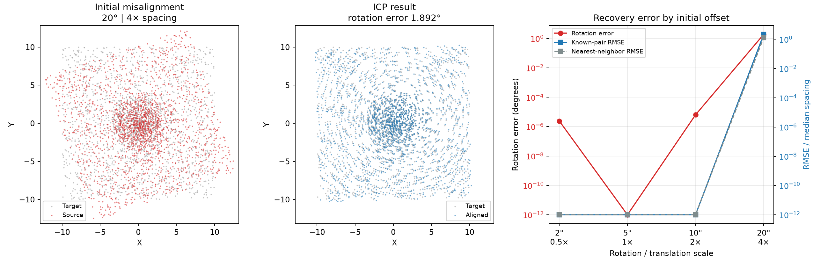

Required iterations increase sharply with the initial offset. In the final
case, nearest-neighbor RMSE is lower than known-pair RMSE because some source
points are close to the wrong target points. The fixed budget therefore
exposes both initialization sensitivity and the limits of evaluating ICP only
with its own correspondence objective.

### Rigid registration: public USGS 3DEP sample

The public sample has a median point spacing of 4.929 input units. With the
same relative transforms and iteration budget, the first two cases recover
exactly, while the 10- and 20-degree cases remain incorrect at iteration 60.

| Rotation / translation | Iterations | Converged in budget | Rotation error | Translation error / spacing | Known-pair RMSE / spacing | NN RMSE / spacing |
| --- | ---: | :---: | ---: | ---: | ---: | ---: |
| 2° / 0.5× | 10 | Yes | <0.001° | <0.001 | <0.001 | <0.001 |
| 5° / 1× | 51 | Yes | <0.001° | <0.001 | <0.001 | <0.001 |
| 10° / 2× | 60 | No | 3.372° | 6.621 | 3.528 | 1.163 |
| 20° / 4× | 60 | No | 5.350° | 10.337 | 5.557 | 1.287 |

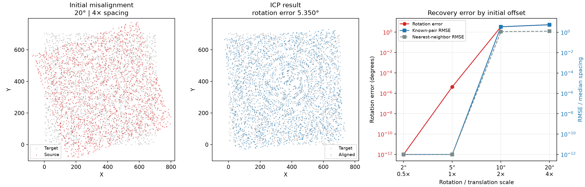

The public terrain sample requires more iterations than the synthetic surface
under the same spacing-relative offsets. Its failed cases also show a larger
gap between known-pair and nearest-neighbor error. This result does not define
a universal ICP capture range; it demonstrates that convergence behavior
depends on geometry, sampling pattern, stopping criteria, and iteration budget.

### Normal estimation: synthetic surface

The input contains 6,000 unevenly sampled points with 0.02-unit Z noise. Its
analytic reference normals come from the underlying noise-free height
function. The controlled perturbation standard deviation is 0.00535 units.

| Neighbors | Median radius | Mean reference error | P95 reference error | Median repeatability error | P95 repeatability error |
| ---: | ---: | ---: | ---: | ---: | ---: |
| 8 | 0.407 | 3.815° | 9.882° | 0.880° | 4.675° |
| 16 | 0.605 | 1.744° | 4.347° | 0.413° | 1.829° |
| 32 | 0.892 | 0.982° | **2.302°** | 0.208° | 0.792° |
| 64 | 1.296 | **0.846°** | 2.417° | **0.111°** | **0.380°** |

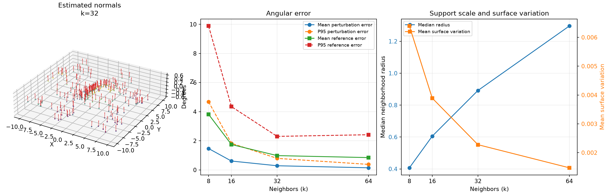

Increasing the neighborhood size substantially improves mean accuracy and
perturbation repeatability. However, the P95 reference error is lowest at
`k=32` and rises slightly at `k=64`, while the median support radius grows to
1.296 units. This tail behavior is consistent with the expected trade-off:
broader support suppresses noise but can mix geometry across a curved,
unevenly sampled surface.

### Normal estimation: public USGS 3DEP sample

The public sample contains 5,000 ground-classified points. It has no
independent normal labels, so this experiment reports perturbation
repeatability and neighborhood diagnostics without claiming reference
accuracy. The controlled perturbation standard deviation is 0.246 input
units.

| Neighbors | Median radius | Mean repeatability error | Median repeatability error | P95 repeatability error | Mean surface variation |
| ---: | ---: | ---: | ---: | ---: | ---: |
| 8 | 15.788 | 0.955° | 0.830° | 2.121° | 4.50e-5 |
| 16 | 22.576 | 0.423° | 0.389° | 0.859° | 3.86e-5 |
| 32 | 32.155 | 0.203° | 0.186° | 0.402° | 2.83e-5 |
| 64 | 45.631 | 0.099° | 0.091° | 0.202° | 2.14e-5 |

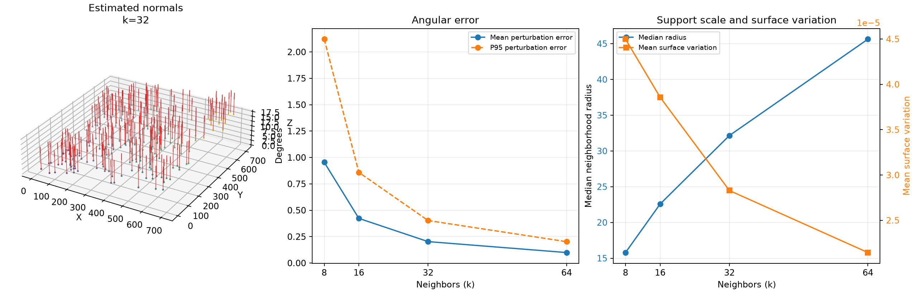

Repeatability improves monotonically with neighborhood size, but the median
support radius nearly triples. Without ground truth, the lower angular change
at `k=64` cannot establish higher accuracy: it may also reflect smoothing over
local terrain structure. Neighborhood selection therefore requires a spatial
detail requirement in addition to a stability target.

### Controlled outliers: synthetic surface

The clean input contains 6,000 points over a 20-by-20 unit wavy surface, with
one third of the samples concentrated near its center. The experiment adds 316
outliers, giving a final outlier fraction of 5%.

| Std. ratio | Precision | Recall | F1 | Inliers retained | Coverage RMSE |
| ---: | ---: | ---: | ---: | ---: | ---: |
| 0.5 | 0.263 | 1.000 | 0.417 | 85.3% | 0.187 |
| 1.0 | 0.697 | 0.984 | 0.816 | 97.8% | 0.068 |
| **1.5** | **0.923** | **0.946** | **0.934** | **99.6%** | **0.030** |
| 2.0 | 0.986 | 0.867 | 0.923 | 99.9% | 0.013 |
| 2.5 | 0.996 | 0.744 | 0.851 | 100.0% | 0.010 |
| 3.0 | 1.000 | 0.579 | 0.733 | 100.0% | 0.000 |

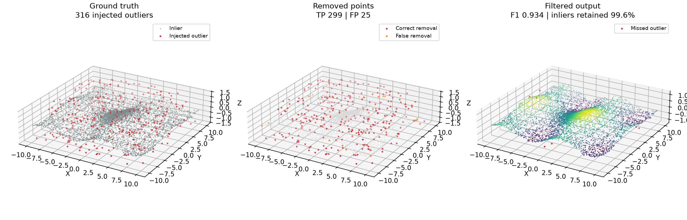

The low threshold detects every injected outlier but also removes 884 valid
points. Increasing the ratio reduces false removals, while recall begins to
fall. A ratio of 1.5 gives the highest F1 in this controlled case; this is an
experimental result, not a general default.

### Controlled outliers: public USGS 3DEP sample

The public-data input contains 5,000 ground-classified points selected
deterministically from a USGS 3DEP Iowa lidar tile. The experiment adds 263
outliers with the same fraction, relative distance scale, neighborhood size,
threshold sweep, and seed as the synthetic experiment.

| Std. ratio | Precision | Recall | F1 | Inliers retained | Coverage RMSE |
| ---: | ---: | ---: | ---: | ---: | ---: |
| 0.5 | 0.321 | 1.000 | 0.486 | 88.9% | 4.332 |
| 1.0 | 0.639 | 0.996 | 0.779 | 97.0% | 2.243 |
| 1.5 | 0.822 | 0.947 | 0.880 | 98.9% | 1.310 |
| **2.0** | **0.916** | **0.913** | **0.914** | **99.6%** | **0.926** |
| 2.5 | 0.963 | 0.791 | 0.868 | 99.8% | 0.620 |
| 3.0 | 0.976 | 0.624 | 0.761 | 99.9% | 0.365 |

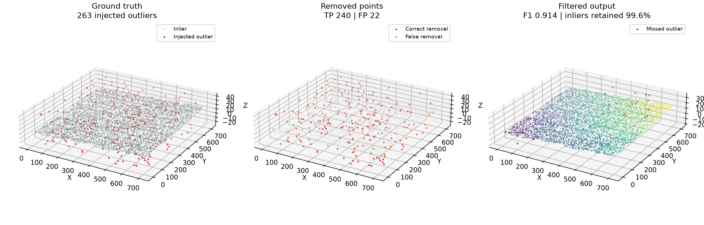

The same precision-recall trade-off appears, but the highest-F1 ratio changes
from 1.5 to 2.0. This difference supports the original hypothesis: even under
controlled contamination, threshold selection depends on the source geometry
and sampling pattern. A production decision should also reflect whether
missed noise or removed surface detail is more costly.

### Voxel downsampling: synthetic surface

| Voxel size | Output points | Retained | Output mean NN distance | Coverage RMSE |
| ---: | ---: | ---: | ---: | ---: |
| 0.25 | 3,545 | 59.1% | 0.203 | 0.065 |
| 0.50 | 1,628 | 27.1% | 0.352 | 0.168 |
| 1.00 | 434 | 7.2% | 0.813 | 0.382 |

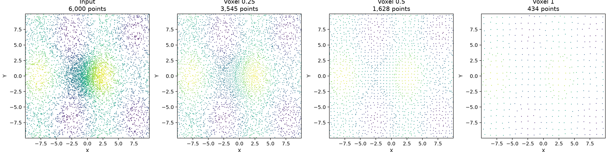

Increasing voxel size regularizes the dense center and sharply reduces the
point count, while point spacing and coverage error both increase.

### Voxel downsampling: public USGS 3DEP sample

Source URL, checksums, counts, filter, seed, and coordinate offsets are
recorded in
[`manifest.csv`](../data/usgs_3dep_iowa/manifest.csv).

| Voxel size | Output points | Retained | Output mean NN distance | Coverage RMSE |
| ---: | ---: | ---: | ---: | ---: |
| 5 | 4,590 | 91.8% | 5.832 | 0.643 |
| 10 | 3,272 | 65.4% | 7.790 | 2.429 |
| 20 | 1,262 | 25.2% | 15.399 | 6.896 |


The 5-unit setting changes this sparse subset only modestly. At 10 and 20
units, point reduction becomes substantial and coverage error rises.
